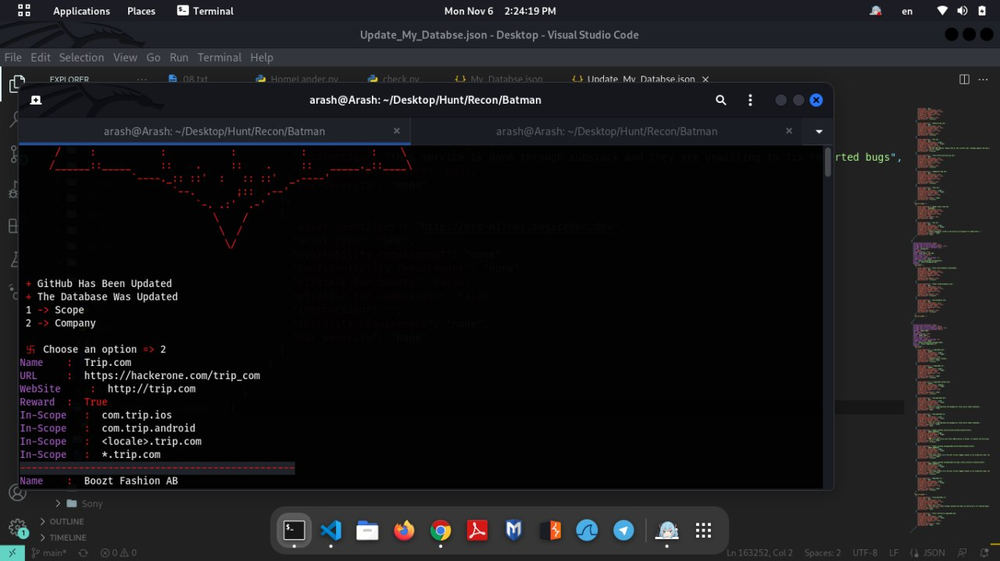

# Watch Tower

  
  &nbsp;&nbsp;
  
  &nbsp;&nbsp;
  

<h1 align="center">Watch Tower</h1>

  Real-Time Asset Monitoring Platform
   
  Built with Python · Laravel · Vue.js

  
  
  

---

## Overview

Watch Tower is a real-time monitoring platform designed to detect newly added assets across defined targets and instantly notify users through multiple channels.

Originally started as a lightweight Python monitoring script for HackerOne scope tracking, the project gradually evolved into a scalable monitoring infrastructure with reactive synchronization, real-time broadcasting, and multi-user support.

The idea behind Watch Tower is simple:

> monitoring should be proactive, not passive.

---

## Product Evolution

### Early Prototype

  

The first version of Watch Tower was a lightweight local Python script focused entirely on instant asset detection.

There was no dashboard.
No frontend.
No infrastructure layer.

Just terminal output, detection logic, and Discord notifications the moment a new asset appeared.

That prototype proved the concept worked — and became the foundation for the current generation.

---

### Current Generation

Watch Tower is now being rebuilt entirely with a scalable and reactive architecture:

| Layer             | Technology      |
| ----------------- | --------------- |
| Backend Core      | Python 3        |
| Application Layer | Laravel 13      |
| Frontend          | Vue.js          |
| Real-Time Sync    | Laravel Echo    |
| Architecture      | WebSocket-based |

The current generation focuses on:

* scalable backend architecture
* reactive synchronization
* infrastructure-focused workflows
* real-time event broadcasting
* multi-user monitoring support

---

## Features

* Real-time asset detection
* Multi-channel notifications
* Reactive dashboard
* Live synchronization
* Multi-user architecture
* Infrastructure-focused design
* Scalable backend structure

---

## Notification Channels

| Channel          | Status  |
| ---------------- | ------- |
| Discord          | ✅       |
| Telegram         | ✅       |
| In-App Dashboard | ✅       |
| SMS              | Planned |

---

## Use Cases

Watch Tower is designed for:

* Security researchers
* DevSecOps workflows
* Infrastructure monitoring
* Real-time alert systems

---

## Development Status

Development recently resumed after a long interruption caused by internet instability and infrastructure limitations.

The project is now actively being rebuilt again, with the current generation expected to reach a stable release within the next 2–3 months.

The delay slowed development — not the vision behind it.

---

## Roadmap

* SaaS deployment
* Team collaboration
* Shared workspaces
* Enterprise integrations
* Analytics layer
* API ecosystem

---

## Contact

* Telegram: [@Octawian](https://t.me/Octawian)
* Email: [arashebi777@gmail.com](mailto:arashebi777@gmail.com)

---

  

